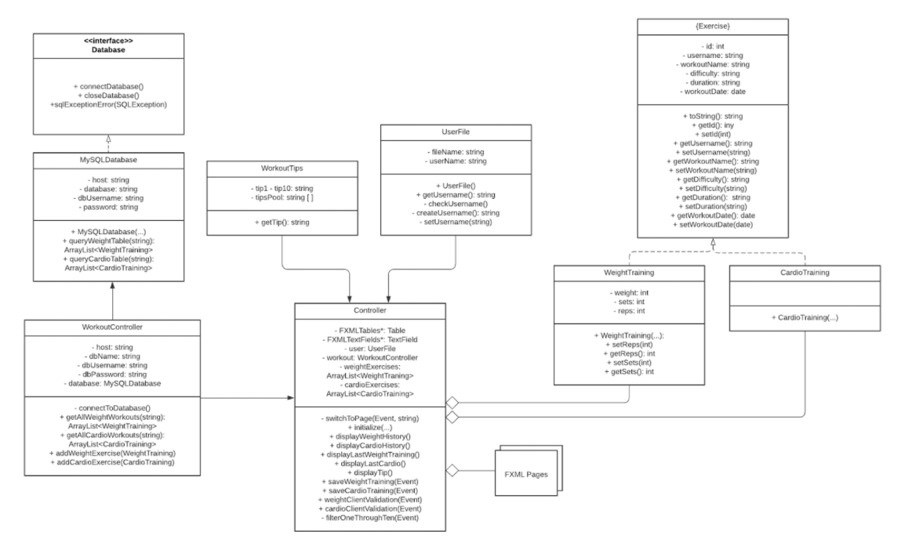
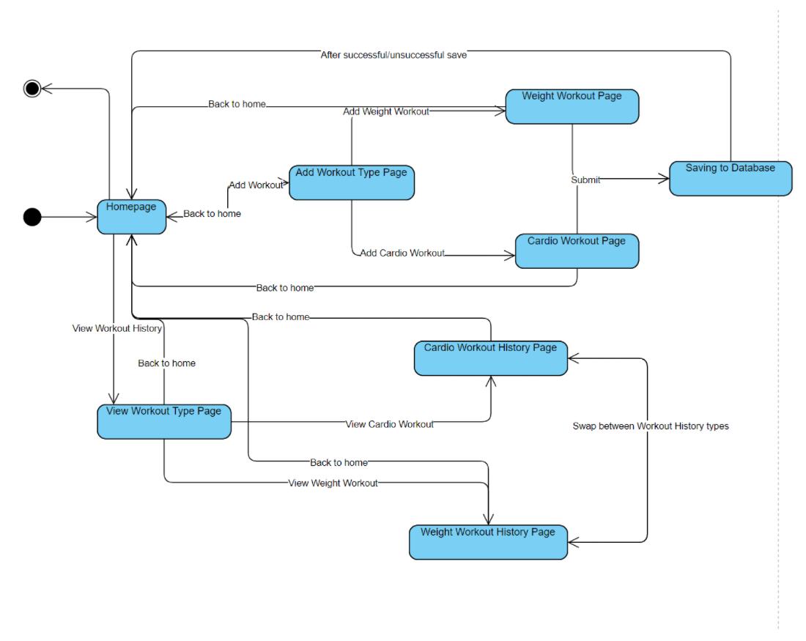
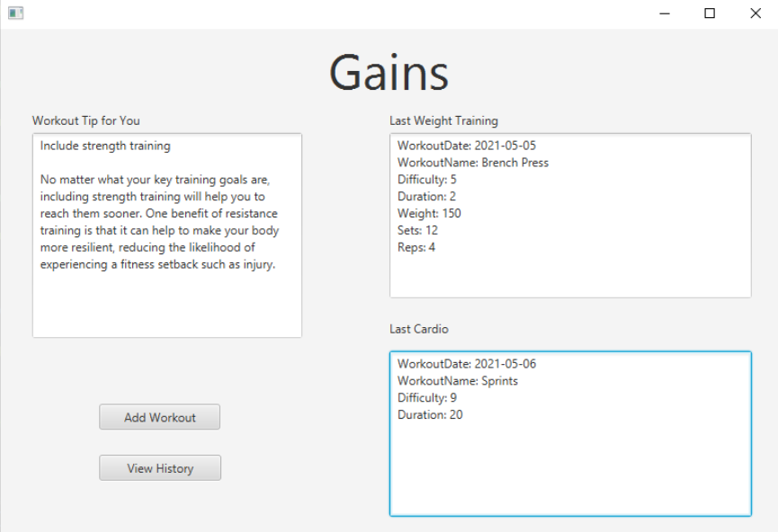
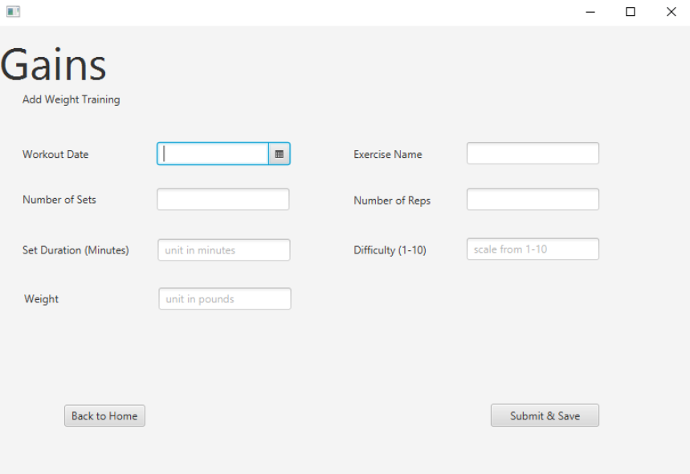
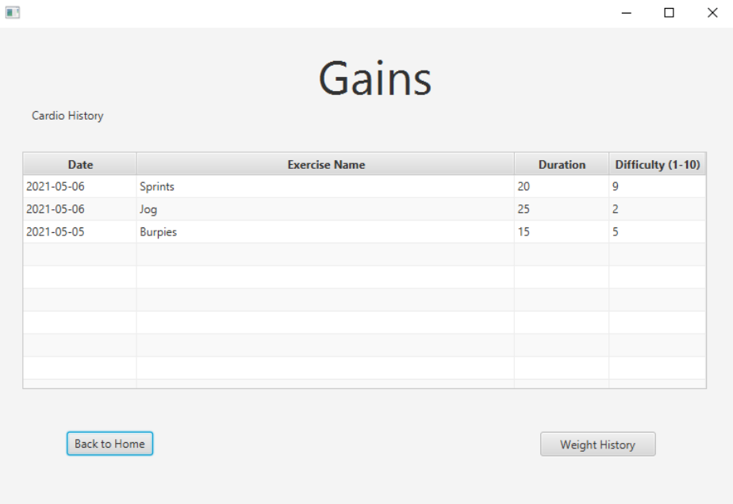

# Gains

Workout journal app built using Java, JavaFX, and AWS RDS MySQL.

## Design

### UML Diagram

### State Diagram

## Screenshots

### Homepage

### Adding Weight Training

### Weight Training History

### Cardio Training History

